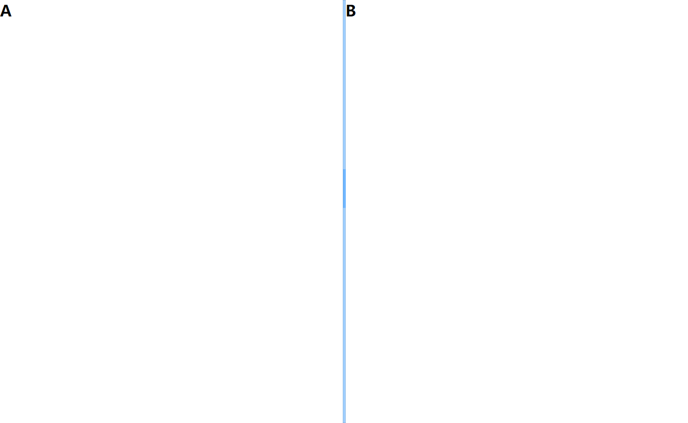
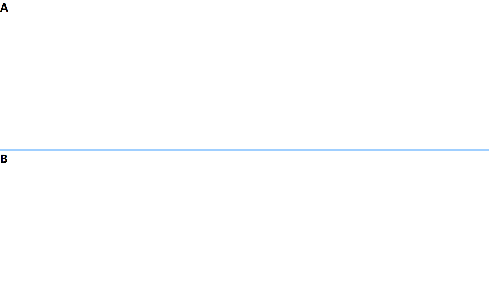
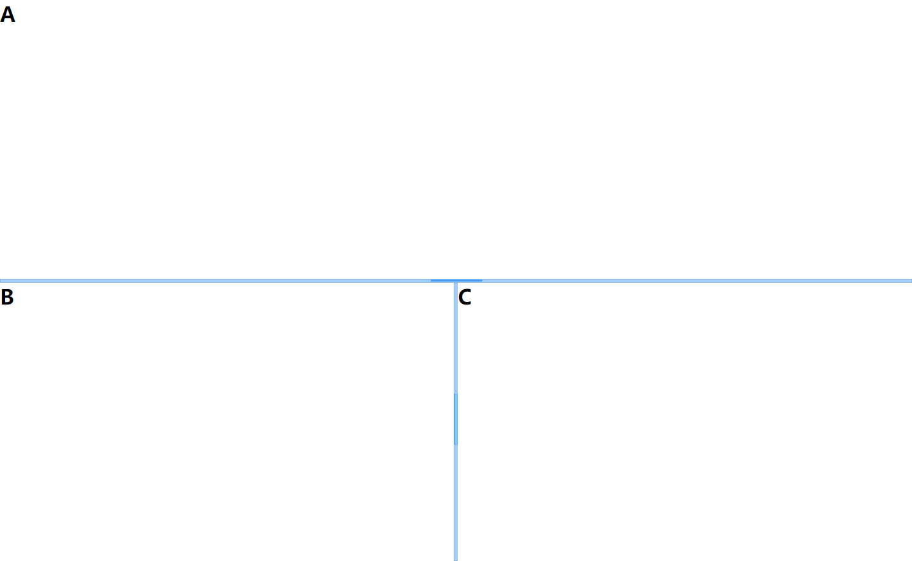
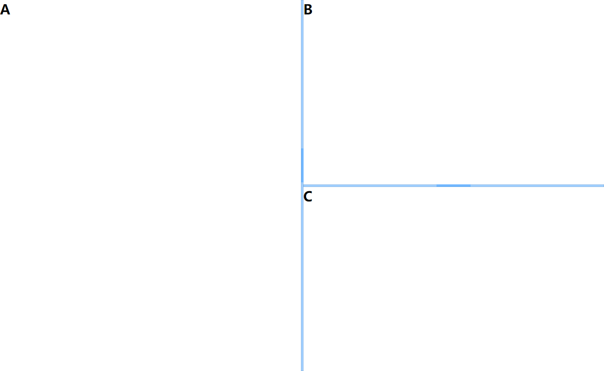
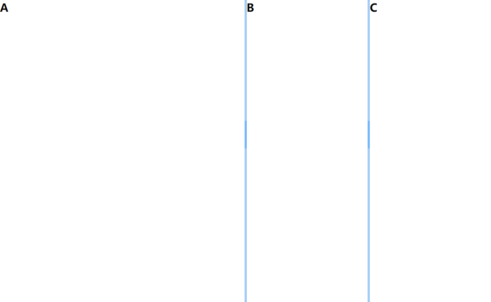
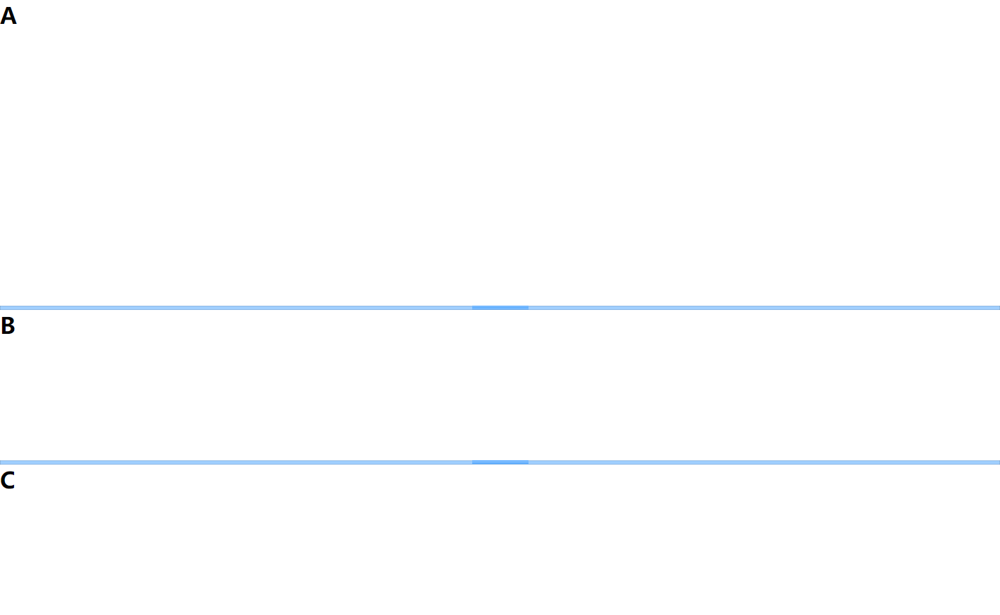

# Vue Page Split

> 基于 Vue 的面板分割

## 安装

``` bash
$ npm i vue-page-split -S
```
## 使用

在 Vue 项目中使用 PageSplit

```html
<template>
  <SplitPane
    :distribute="0.5"
    :lineThickness="6"
    :isVertical="false"
    @resizeLineStartMove="onresizeLineStartMove"
    @resizeLineMove="onResizeLineMove"
    @resizeLineEndMove="onresizeLineEndMove"
  >
    <template v-slot:first>
      <h1>A</h1>
    </template>
    <template v-slot:second>
      <h1>B</h1>
    </template>
  </SplitPane>
</template>
<script>
import PageSplit from "vue-page-split";

export default {
  components: {
    SplitPane
  },
  methods: {
    onresizeLineStartMove: function() {
      console.log("onresizeLineStartMove");
    },
    onResizeLineMove: function(e) {
      console.log("onResizeLineMove :>> ", e);
    },
    onresizeLineEndMove: function() {
      console.log("onresizeLineEndMove");
    }
  }
};
</script>
```

## 属性

| 属性名                  | 类型    | 默认值    | 说明                                   |
|-------------------------|---------|-----------|----------------------------------------|
| distribute              | Number  | 0.5       | 面板比例，取值范围 0~1                 |
| isVertical              | Boolean | true      | 切割模式(true:垂直切割,false:水平切割) |
| lineThickness           | Number  | 6         | 分割线的宽度                           |
| hasLineTip              | Boolean | true      | 分割线中是否有三条杠                   |
| backgroundColor         | String  | "#a0cfff" | 分割线的背景颜色                       |
| hoverColor              | String  | "#409eff" | 分割线的鼠标hover后的颜色              |
| hasBoxShadow            | Boolean | true      | 分割线是否有box-shadow样式             |
| firstMinValue           | Number  | 0         | 左组件/上组件的最小宽度/高度，必须>=0  |
| secondMinValue          | Number  | 0         | 右组件/下组件的最小宽度/高度，必须>=0  |
| isFirstComponentMasked  | Boolean | false     | 左组件/上组件是否需要遮挡层            |
| isSecondComponentMasked | Boolean | false     | 右组件/下组件是否需要遮挡层            |


备注：遮挡层用于捕获鼠标事件，主要在组件内包含iframe时使用，因为iframe会“吞噬”鼠标事件


## 事件
本组件会触发3个事件：

| 事件名              | 说明     | 返回值    |
|---------------------|----------|-----------|
| resizeLineStartMove | 拖拽开始 | -         |
| resizeLineMove      | 拖拽中   | event对象 |
| resizeLineEndMove   | 拖拽结束 | -         |


## 效果图






